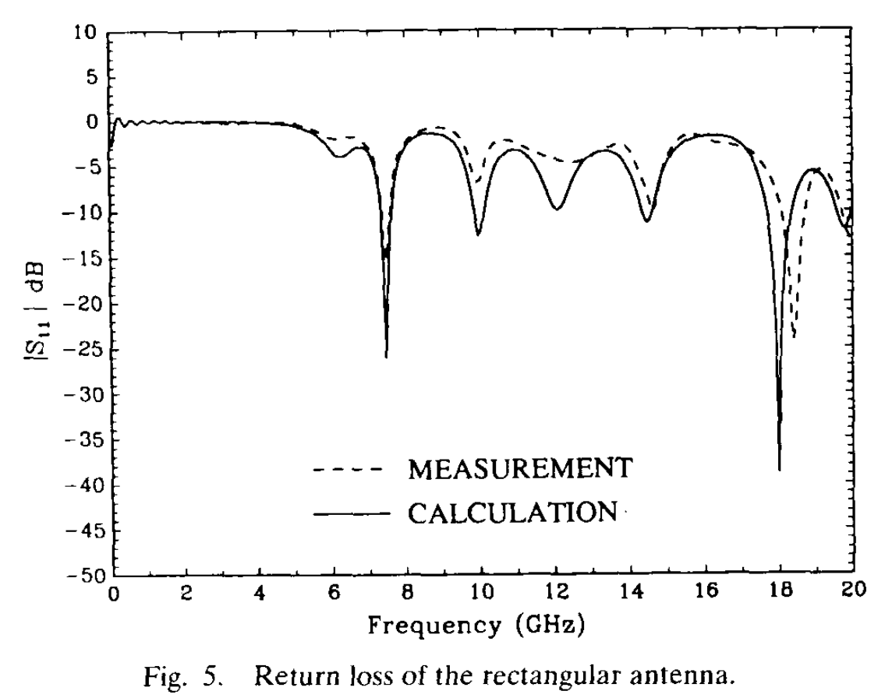
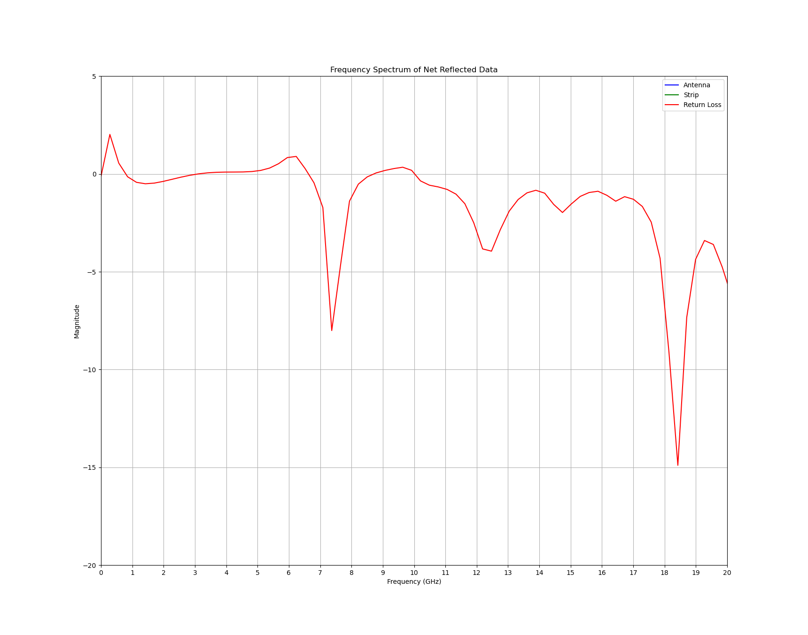
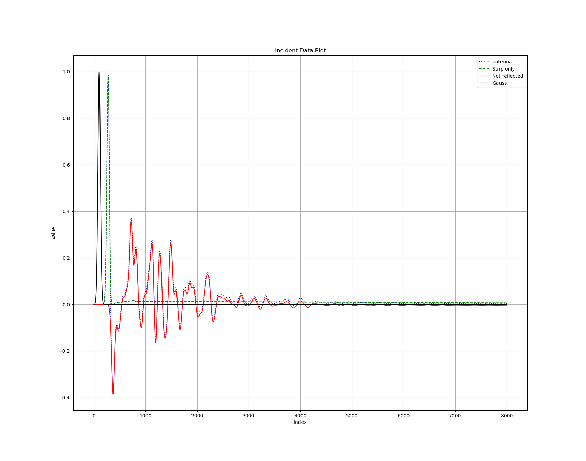

# Patch Antenna FDTD Simulation with CUDA acceleration

by 林萬荃 at National Taiwan University

## Description

This project is a CUDA-accelerated FDTD simulation of a patch antenna. The simulation is based on the paper by Sheen et al. [1]. The original code is written in C++ and is available from [Pete Bevelacqua's website](https://www.antenna-theory.com/antennas/patches/patch6.php) [2]. The original code is modified to use CUDA for acceleration.

### Pre-requisites

- CUDA Toolkit 12.0
- Python 3.11
- ffmpeg with h264_nvenc codec
- matplotlib
- numpy
- tqdm

## Usage

To compile the code, run the following command:

```bash
make main
```

or

```bash
nvcc -o fdtd main.cu -lcuda -lcudart
```

Create a junk, buffer directory to store the output files:

```bash
mkdir junk
mkdir buffer
```

Go to the junk directory and run the executable:

```bash
cd junk
../fdtd
cd ..
```

The output files are in the junk directory. To visualize the results, run the following command:

```bash
python plotCPU.py
```

To concatenate the output PNG files into a video, run the following command:

```bash
ffmpeg -hwaccel cuda -framerate 60 -pattern_type glob -i 'buffer/*.png' -c:v h264_nvenc -preset fast output.mp4
```

To see the resultant return-loss of the antenna, run the following command:

```bash
python plotEz.py
```

> Note that the above command require you to install ffmpeg with the `h264_nvenc` codec. Check Nvidia website for more information.

## Results

<div align="center">
    
</div>
This is the electric field under the patch antenna. The electric field is excited by a Gaussian pulse at the feed line.

> Note that the simulation is sample every 5 time steps. So 1600 frames correspond to 8000 time steps.

<div align="center">
    
    
</div>
On the right is the return loss of the patch antenna measured and computed by the original paper. On the left is the return loss of the patch antenna computed by the CUDA-accelerated FDTD simulation.

<div align="center">
    
</div>
This is the time waveform of the electric field under the feed line.

## Reference

[1]
D. M. Sheen, S. M. Ali, M. D. Abouzahra and J. A. Kong, "Application of the three-dimensional finite-difference time-domain method to the analysis of planar microstrip circuits," in IEEE Transactions on Microwave Theory and Techniques, vol. 38, no. 7, pp. 849-857, July 1990, doi: 10.1109/22.55775. keywords: {Finite difference methods;Time domain analysis;Microstrip antennas;Microstrip components;Circuits;Antenna accessories;Impedance;Patch antennas;Frequency;Scattering parameters}

[2]
[Source code from Pete Bevelacqua - EE 517](https://www.antenna-theory.com/antennas/patches/patch6.php)
